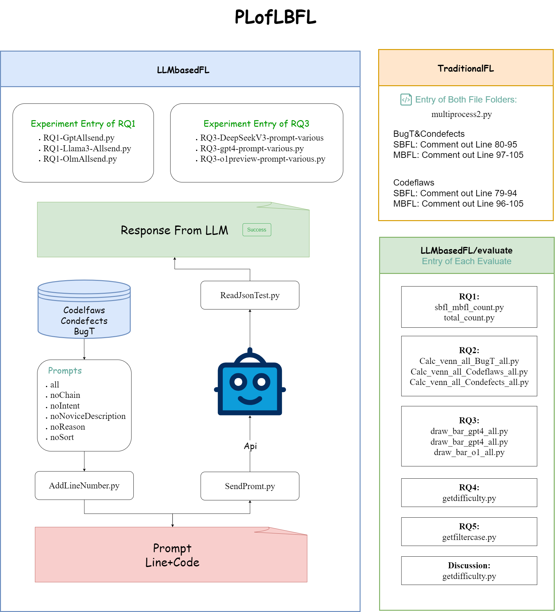

# Overall
This is all the experimental code for an empirical study on the performance of LLMs in assisting novice programmers with fault localization, along with specific steps for paper replication.



## 1. Requirements

Locate the **requirements.txt** file in the root directory and execute the following dependency command.

```
pip install -r requirements.txt
```

Should there be any additional dependencies missing, feel free to sequentially import them using pip based on the provided information.


## 2. LLMs

In this study, multiple different LLMs were used for experimentation, namely  o1-preview, o1-mini, GPT-4, GPT-4o, GPT-3.5-Turbo, ChatGLM4, ChatGLM3, DeepSeekV3, Llama3, Llama2, Code Llama.

Among these, ChatGLM4, ChatGLM3, DeepSeekV3, Llama3, Llama2, Code Llama are open-source LLMs that can be deployed following their respective official documentation. The versions used and their corresponding official website links are provided below:

| Model Name                              | HggingFace Url                                               |
| --------------------------------------- | ------------------------------------------------------------ |
| **THUDM/glm-4-9b-hf**                   | **https://huggingface.co/THUDM/glm-4-9b-hf**                 |
| **THUDM/chatglm3-6b**                   | **https://huggingface.co/THUDM/chatglm3-6b**                 |
| **meta-llama/Meta-Llama-3-8B**          | **https://huggingface.co/meta-llama/Meta-Llama-3-8B**        |
| **meta-llama/Llama-2-7b-chat-hf**       | **https://huggingface.co/meta-llama/Llama-2-7b-chat-hf**     |
| **meta-llama/CodeLlama-7b-Instruct-hf** | **https://huggingface.co/meta-llama/CodeLlama-7b-Instruct-hf** |


For conducting experiments on commercial LLMs like o1-preview, o1-mini, GPT-4, GPT-4o, GPT-3.5-Turbo, DeepSeekV3,, we utilize the official API interfaces provided.

To standardize our experiments, for all open-source LLMs, we employ the API interfaces in the format of commercial LLMs. Instructions on deploying a commercial LLM form API interface can be found at https://github.com/xusenlinzy/api-for-open-llm.


## 3. Dataset


The raw data and code for this experiment can be downloaded from https://drive.google.com/file/d/1wTPfaopLCHTGh3pEWc5IE2kp6RJ5dgcr/view?usp=drive_link.


There exists a complete CodeFlaws dataset, a ConDefects dataset, and a BugT dataset.

All experimental data for this study is directly stored within various versions of the CodeFlaws and ConDefects datasets. For instance, the experimental results for ChatGPT-4 in CodeFlaws-v1 are stored in the directory blow.

```
datasets\data\codeflaws\version\v1\test_data\gpt-4 
```


## 4. Run

In order to facilitate the reproduction of the experiment, we have organized the main code into the **LLMbasedFL** directory. To reproduce the experiment, you only need to pay attention to this folder.

The TraditionalFLForBugT&Condefects and TraditionalFLForCodeflaws folders contain experimental codes for traditional error location (SBFL, MBFL). Users can conduct experiments on their own.


- Navigate to the **LLMbasedFL** directory:

  **Sendpromt** is used to send requests to LLMs and collect results.

  - Within it, the function *send_prompt_openai_gpt* is used for sending requests to GPT. In this function, the *base_url* and *api_key* need to be changed to correspond to the requested link address and key, which can be obtained by purchasing credits on the official website.
  - The *send_prompt_openai_form* function is used for requests to open-source LLMs. Simply modify the request address to the API address of the aforementioned LLM. The key can be filled in arbitrarily.
  - <u>It is advisable to test the Sendpromt requests for successful validation before proceeding to the next step.</u>

The *ReadJsonTest* function is utilized to extract the JSON fields from the results returned by the LLM.

The *getTokenNumbers* function is employed to extract the token count of the prompt.

*AddLineNumber* is responsible for processing the source code by adding line numbers to each line.

------

RQ1-GptAllSend, RQ1-Llama3-AllSend and RQ1-OlmAllsend are employed to dispatch requests for novice program fault localization in bulk to various LLMs, subsequently storing the resulting data in the 'data' repository.

Before execution, certain configurations pertaining to your setup necessitate adjustments. For illustrative purposes, let us consider the instance of *Gpt4-AllSend*:

- The *'prompt_location'* parameter serves to acquire prompts and can be altered to accommodate a custom prompt of your choice.
- Both *'run_Codeflaws'* function and *'run_Condefects'*  function involve traversing the respective datasets once for data retrieval, with the *<u>'root_path'</u>* requiring adjustment to reflect the location where the dataset is stored.
- *'Condefects_Filter_Data.pkl'* houses the program information filtered from our dataset.

------

The file *'RQ3-DeepSeekV3-prompt-various'*,*'RQ3-gpt4-prompt-various'*,and *'RQ3-o1preview-prompt-various'* is utilized to conduct experiments with a variety of distinct prompts, all of which are housed within the 'prompts' directory.


